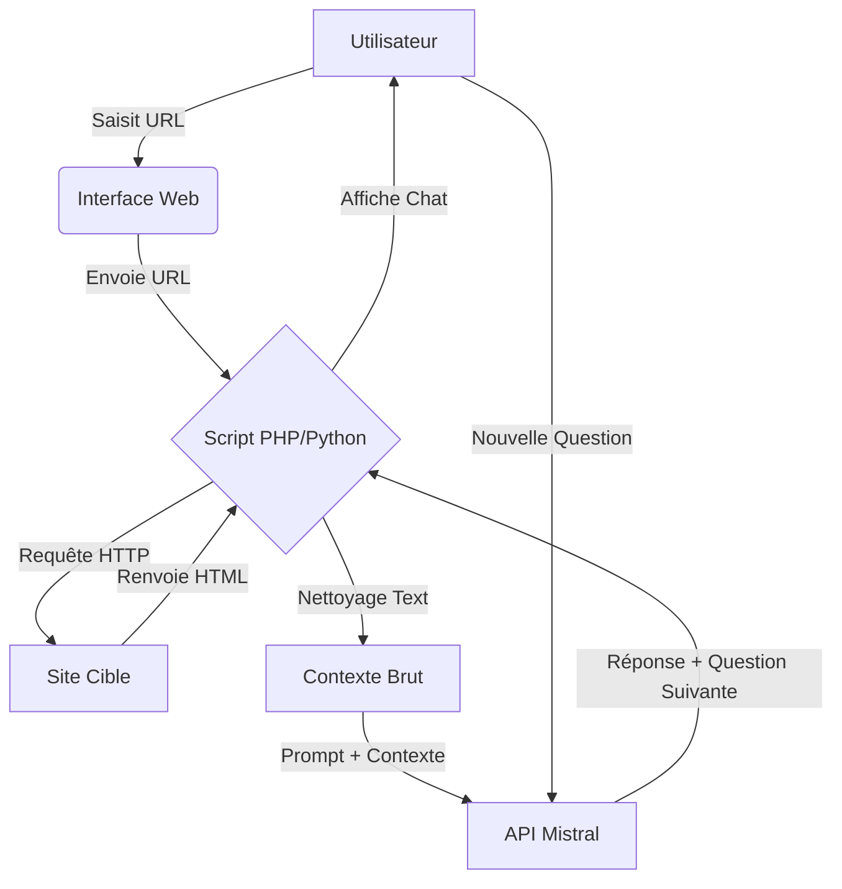

# 🤖 IA Web Crawler & Conversational Agent

## 📑 Table des Matières

1. [But du Site](#-but-du-site)
2. [Architecture et Fonctionnement](#-architecture-et-fonctionnement)
3. [Détail des Prompts](#-détail-des-prompts)
4. [Mode Boucle : Génération de Questions par l'IA](#-mode-boucle--génération-de-questions-par-lia)
5. [Méthode de Crawl](#-méthode-de-crawl)
6. [Obtenir une API Key Mistral (Free Tier)](#-obtenir-une-api-key-mistral-free-tier)
7. [Mode d'Emploi](#-mode-demploi)
8. [Cas d'Usage](#-cas-dusage)
9. [12 Modifications d'Optimisation Possibles](#-12-modifications-doptimisation-possibles)
10. [Transformation en Analyseur SEO](#-transformation-en-analyseur-seo)
11. [12 Cas Pratiques de Transformation](#-12-cas-pratiques-de-transformation)

---

## 🎯 But du Site

Ce projet a pour objectif de créer un **agent conversationnel intelligent capable d'explorer le web**, d'extraire des informations pertinentes à partir d'une URL donnée, et d'engager un dialogue contextuel avec l'utilisateur basé sur le contenu analysé.

### Objectifs Principaux :
- **Automatiser la veille informationnelle** : Extraire et synthétiser du contenu web sans intervention manuelle.
- **Créer une interface conversationnelle intuitive** : Permettre aux utilisateurs d'interroger le contenu d'une page web comme s'ils discutaient avec un expert du sujet.
- **Générer des questions proactives** : L'IA ne se contente pas de répondre, elle propose la prochaine question pertinente pour approfondir le sujet (mode boucle).
- **Démocratiser l'accès à l'IA** : Utiliser des modèles performants (Mistral) accessibles gratuitement via leur tier gratuit.

### Public Cible :
- Chercheurs et étudiants ayant besoin de synthèses rapides.
- Marketeurs digitaux pour l'analyse de concurrents.
- Développeurs souhaitant intégrer de l'IA générative dans leurs outils.
- Curieux voulant explorer le web de manière interactive.

---

## 🏗️ Architecture et Fonctionnement

Le système repose sur une architecture simple mais puissante en trois blocs :

1.  **Le Crawler (Backend)** : Récupère le HTML brut d'une URL, le nettoie pour ne garder que le texte pertinent.
2.  **Le Moteur IA (API Mistral)** : Reçoit le contexte (texte de la page) et l'historique de conversation pour générer des réponses et la prochaine question.
3.  **L'Interface (Frontend)** : Une interface utilisateur (HTML/JS ou Streamlit) affichant le chat et gérant les états de session.



---

## 📝 Détail des Prompts

La qualité des réponses dépend entièrement de la précision des prompts (instructions données à l'IA). Voici la structure détaillée utilisée dans ce projet.

### 1. Prompt de Système (System Prompt)
Ce prompt définit la personnalité et les contraintes de l'IA. Il est envoyé à chaque appel API.

```text
Tu es un assistant expert en analyse web et en synthèse d'information.
Ton rôle est d'aider l'utilisateur à comprendre le contenu d'une page web spécifique.

RÈGLES STRICTES :
1. Base tes réponses UNIQUEMENT sur le contenu fourni dans le contexte ci-dessous.
2. Si l'information n'est pas dans le contexte, dis-le clairement. N'invente rien.
3. Sois concis, structuré et utilise des listes à puces si nécessaire.
4. À la fin de CHAQUE réponse, tu dois impérativement générer une "Question Suggérée" pour aider l'utilisateur à approfondir le sujet.
5. Format de sortie attendu :
   - [Ta réponse détaillée]
   - ---
   - 💡 Question suggérée : [La question]
```

### 2. Prompt Utilisateur (User Prompt)
Ce prompt combine le contexte extrait du site et l'historique de la conversation.

```text
CONTEXTE DU SITE WEB :
"""
{CONTENU_EXTRAIT_DU_CRAWL}
"""

HISTORIQUE DE LA CONVERSATION :
{HISTORIQUE_CHAT}

QUESTION ACTUELLE DE L'UTILISATEUR :
"{QUESTION_UTILISATEUR}"

Réponds à la question en utilisant le contexte. Termine par ta suggestion de question.
```

### 3. Prompt de Résumé (Optionnel)
Si le contenu est trop long pour tenir dans la fenêtre de contexte du modèle, un premier passage peut être fait pour résumer le texte avant la conversation.

```text
Résume le texte suivant en gardant les points clés, les chiffres importants et les noms propres. Le résumé doit faire moins de 2000 mots.
Texte : {CONTENU_BRUT}
```

---

## 🔄 Mode Boucle : Génération de Questions par l'IA

Le "Mode Boucle" est la fonctionnalité clé qui transforme une simple recherche en une exploration guidée. Au lieu d'attendre passivement la prochaine requête, l'IA devient proactive.

### Mécanisme de la Boucle

1.  **Input** : L'utilisateur pose une question ou valide une suggestion.
2.  **Traitement** : L'IA analyse le contexte et l'historique.
3.  **Output Dual** : L'IA renvoie deux éléments :
    *   La **Réponse** à la question posée.
    *   La **Next Question** : Une question pertinente déduite de la réponse précédente pour pousser l'analyse plus loin.
4.  **Rendu UI** : L'interface affiche la réponse et transforme la "Next Question" en un bouton cliquable.
5.  **Bouclage** : Si l'utilisateur clique sur le bouton, cette question devient automatiquement le nouvel input, et le cycle recommence.

### Diagramme de Flux de la Boucle

```
[Début] -> [Utilisateur clique sur "Analyser URL"]
   |
   v
[Crawl & Extraction du Texte]
   |
   v
[Envoi Contexte à Mistral] -> [Réponse Initiale + Question Suggérée #1]
   |
   v
[Affichage Interface] <--> [Bouton: "Question Suggérée #1"]
   |                          (Si clic)
   v                          |
[Utilisateur tape ou clique] <-+
   |
   v
[Nouvel Envoi API (avec historique)] -> [Réponse + Question Suggérée #2]
   |
   .
   . (La boucle continue tant que l'utilisateur interagit)
   .
```

### Exemple Concret

*   **URL** : Article sur le réchauffement climatique.
*   **User** : "Quelles sont les causes principales ?"
*   **IA** : "Les causes principales sont l'émission de CO2, la déforestation..."
    *   *Suggestion IA* : "💡 Voulez-vous connaître l'impact précis de la déforestation en Amazonie mentionné dans l'article ?"
*   **User** : (Clique sur la suggestion)
*   **IA** : "Selon l'article, la déforestation en Amazonie représente 15% des émissions globales..."
    *   *Suggestion IA* : "💡 Quelles solutions proposées par l'auteur pour inverser cette tendance ?"

---

## 🕷️ Méthode de Crawl

Pour garantir la compatibilité et la simplicité, nous utilisons une méthode de crawl "léger" basée sur les fonctions natives de récupération de contenu, suivie d'un nettoyage agressif pour ne garder que le texte lisible par l'IA.

### Étape 1 : Récupération du HTML (cURL / file_get_contents)

Nous récupérons le code source complet de la page.

*Exemple en PHP :*
```php
$url = $_POST['url'];
$ch = curl_init();
curl_setopt($ch, CURLOPT_URL, $url);
curl_setopt($ch, CURLOPT_RETURNTRANSFER, true);
curl_setopt($ch, CURLOPT_FOLLOWLOCATION, true); // Suivre les redirections
curl_setopt($ch, CURLOPT_USERAGENT, 'Mozilla/5.0 (compatible; IA-Bot/1.0)'); // Éviter certains blocages
$html = curl_exec($ch);
curl_close($ch);
```

### Étape 2 : Nettoyage du DOM (DOMDocument)

Le HTML brut contient trop de bruit (scripts, styles, menus, pieds de page) qui perturbe l'IA et consomme inutilement les tokens. Nous utilisons `DOMDocument` pour extraire uniquement le corps du texte.

*Algorithme de nettoyage :*
1.  Charger le HTML dans `DOMDocument`.
2.  Supprimer toutes les balises `<script>`, `<style>`, `<nav>`, `<footer>`, `<header>`.
3.  Extraire le texte de la balise `<body>` ou spécifiquement des balises `<article>` et `<p>`.
4.  Remplacer les multiples espaces et sauts de ligne par un espace unique.
5.  Tronquer le texte si il dépasse la limite de tokens du modèle (ex: 32k tokens pour Mistral Large).

*Exemple de code de nettoyage :*
```php
libxml_use_internal_errors(true);
$dom = new DOMDocument();
$dom->loadHTML($html);

// Supprimer les éléments inutiles
foreach (['script', 'style', 'nav', 'footer', 'header'] as $tag) {
    foreach ($dom->getElementsByTagName($tag) as $node) {
        $node->parentNode->removeChild($node);
    }
}

// Extraire le texte
$text = $dom->textContent;
// Nettoyage des espaces blancs
$text = preg_replace('/\s+/', ' ', $text);
// Limitation de longueur (ex: 15000 caractères pour sécurité)
$text = substr($text, 0, 15000);
```

### Pourquoi cette méthode ?
- **Rapide** : Pas besoin de navigateur headless lourd (comme Selenium) sauf pour les sites JS purs (SPA).
- **Économe** : Réduit drastiquement le nombre de tokens envoyés à l'API, réduisant le coût et la latence.
- **Efficace** : Suffisant pour 90% des sites d'articles, blogs et documentation.

---

## 🔑 Obtenir API Key Free Tier Mistral

Mistral AI offre un niveau gratuit généreux pour tester leurs modèles, parfait pour ce type de projet.

### Procédure étape par étape :

1.  **Créer un compte**
    *   Rendez-vous sur la console Mistral : [console.mistral.ai](https://console.mistral.ai/)
    *   Inscrivez-vous avec un compte Google, GitHub ou votre email.

2.  **Accéder à la section API Keys**
    *   Une fois connecté, cliquez sur votre profil en haut à droite.
    *   Sélectionnez **"API Keys"** dans le menu déroulant.

3.  **Générer une clé**
    *   Cliquez sur le bouton **"Create new key"**.
    *   Donnez-lui un nom explicite (ex: `Projet-Crawler-Web`).
    *   Copiez immédiatement la clé générée (elle commence par `sk-...`).
    *   ⚠️ **Attention** : Elle ne sera affichée qu'une seule fois.

4.  **Vérifier le plan Gratuit (Free Tier)**
    *   Allez dans la section **"Billing"** ou **"Usage"**.
    *   Mistral offre souvent un crédit initial gratuit ou un accès gratuit limité aux modèles comme `mistral-tiny` ou `mistral-small` pendant une période d'essai ou avec des limites de taux (rate limits).
    *   *Note* : Les politiques changent, vérifiez toujours la page de tarification actuelle. Même sans crédit illimité, le coût par requête sur les petits modèles est négligeable pour un usage personnel.

5.  **Configuration dans le code**
    *   Créez un fichier `.env` à la racine de votre projet (ne jamais le committer sur Git).
    *   Ajoutez : `MISTRAL_API_KEY=votre_cle_ici`
    *   Dans votre code, récupérez la variable d'environnement.

---

## 🛠️ Mode d'Emploi

Voici comment installer et lancer le projet sur votre machine locale.

### Prérequis
- PHP 7.4 ou supérieur (ou Python 3.8+)
- Composer (si gestion de dépendances PHP) ou pip (pour Python)
- Une clé API Mistral
- Un serveur local (XAMPP, MAMP, ou `php -S localhost:8000`)

### Installation (Version PHP)

1.  **Cloner le projet**
    ```bash
    git clone https://github.com/votre-user/ia-web-crawler.git
    cd ia-web-crawler
    ```

2.  **Configurer l'API Key**
    Créez un fichier `config.php` (ou `.env`) :
    ```php
    <?php
    define('MISTRAL_API_KEY', 'sk-votre-cle-secrete-ici');
    define('MISTRAL_ENDPOINT', 'https://api.mistral.ai/v1/chat/completions');
    ?>
    ```

3.  **Lancer le serveur**
    ```bash
    php -S localhost:8000
    ```

4.  **Utiliser l'application**
    *   Ouvrez votre navigateur à `http://localhost:8000`.
    *   Collez l'URL d'un article de blog ou d'une page d'information.
    *   Cliquez sur "Analyser".
    *   Posez vos questions ou utilisez les suggestions automatiques.

### Installation (Version Python/Streamlit)

1.  **Installer les dépendances**
    ```bash
    pip install streamlit requests beautifulsoup4 mistralai
    ```

2.  **Lancer l'app**
    ```bash
    streamlit run app.py
    ```

---

## 💡 Cas d'Usage

Ce outil est polyvalent et s'adapte à de nombreux scénarios professionnels et personnels.

1.  **Veille Concurrentielle Rapide**
    *   *Scénario* : Vous voulez savoir quelles sont les nouvelles fonctionnalités d'un concurrent.
    *   *Action* : Entrez l'URL de leur page "Nouveautés". Demandez : "Quelles sont les 3 fonctionnalités majeures ajoutées ce mois-ci ?"

2.  **Synthèse de Documentation Technique**
    *   *Scénario* : Une documentation API est trop longue.
    *   *Action* : Entrez l'URL de la doc. Demandez : "Comment authentifier une requête selon cette page ?" puis "Quels sont les codes d'erreur possibles ?".

3.  **Préparation d'Entretien / Réunion**
    *   *Scénario* : Vous rencontrez un client demain.
    *   *Action* : Entrez l'URL de leur page "À propos" et "Actualités". Demandez : "Quels sont les défis récents mentionnés par l'entreprise ?"

4.  **Fact-Checking Immédiat**
    *   *Scénario* : Vous doutez d'une information vue sur les réseaux sociaux liée à un article.
    *   *Action* : Mettez le lien de l'article source. Demandez : "L'article mentionne-t-il explicitement [l'affirmation] ?"

5.  **Apprentissage Accéléré**
    *   *Scénario* : Étudiant devant un cours en ligne dense.
    *   *Action* : L'IA génère des questions de révision basées sur le contenu du cours ("Mode Boucle").

6.  **Analyse de Sentiment Produit**
    *   *Scénario* : Lire des centaines d'avis clients.
    *   *Action* : Si la page liste des avis, demandez : "Quel est le ton général des avis ? Quels sont les défauts récurrents cités ?"

7.  **Extraction de Données Structurées**
    *   *Scénario* : Récupérer une liste de prix ou de dates.
    *   *Action* : "Liste tous les événements et leurs dates mentionnés sur cette page sous forme de tableau."

8.  **Traduction Contextuelle**
    *   *Scénario* : Page web dans une langue étrangère.
    *   *Action* : "Résume-moi le contenu de cette page en français en expliquant les termes techniques."

---

## 🚀 12 Modifications d'Optimisation Possibles

Pour passer d'un prototype à un outil de production, voici 12 pistes d'amélioration technique et fonctionnelle.

1.  **Gestion du Cache (Redis/Memcached)**
    *   *Problème* : Recrawler la même URL coûte du temps et des tokens.
    *   *Solution* : Stocker le contenu extrait et la première réponse en cache pendant 24h. Si l'URL est redemandée, servir depuis le cache.

2.  **Support des Sites SPA (React/Vue/Angular)**
    *   *Problème* : cURL ne voit pas le contenu généré en JavaScript.
    *   *Solution* : Intégrer **Puppeteer** ou **Playwright** (Node.js/Python) pour rendre la page complètement avant extraction.

3.  **Découpage Intelligent (Chunking) + RAG**
    *   *Problème* : Les pages très longues dépassent la limite de tokens.
    *   *Solution* : Découper le texte en chunks de 2000 tokens, indexer dans une base vectorielle (ChromaDB/Pinecone), et utiliser le RAG (Retrieval Augmented Generation) pour ne récupérer que les passages pertinents à la question.

4.  **Streaming de la Réponse**
    *   *Problème* : L'attente de la réponse complète est longue.
    *   *Solution* : Utiliser le mode `stream: true` de l'API Mistral pour afficher le texte mot par mot en temps réel (Server-Sent Events).

5.  **Détection de Langue Automatique**
    *   *Problème* : Le prompt est fixe.
    *   *Solution* : Détecter la langue du site crawlé et adapter automatiquement la langue de réponse de l'IA sans intervention utilisateur.

6.  **Export des Conversations**
    *   *Ajout* : Bouton pour télécharger l'historique du chat en PDF ou Markdown.

7.  **Mode "Comparaison"**
    *   *Ajout* : Permettre de soumettre 2 URLs et demander à l'IA de comparer les contenus ("Compare les offres de ces deux pages").

8.  **Interface Multi-Utilisateurs avec Auth**
    *   *Ajout* : Système de login pour sauvegarder l'historique des crawls par utilisateur.

9.  **Optimisation du Nettoyage HTML**
    *   *Amélioration* : Utiliser des heuristiques (comme l'algorithme de Readability de Mozilla) pour mieux identifier le contenu principal vs les pubs, plutôt que de simples suppressions de balises.

10. **Rate Limiting & Quotas**
    *   *Sécurité* : Limiter le nombre de requêtes par IP pour éviter les abus et contrôler les coûts API.

11. **Support des Images et OCR**
    *   *Avancé* : Si le site contient des infographies importantes, utiliser un modèle multimodal (comme Mistral Pixtral) pour analyser aussi les images.

12. **Intégration Navigateur (Extension Chrome)**
    *   *Déploiement* : Transformer l'outil en extension Chrome pour analyser la page courante en un clic sans copier-coller l'URL.

---

## 🔍 Comment changer le code pour faire de l'analyse SEO

Transformer ce crawler en auditeur SEO est naturel car il possède déjà le contenu brut. Il suffit de modifier le **System Prompt** et d'ajouter quelques métriques techniques.

### 1. Modification du System Prompt

Remplacez le prompt actuel par une instruction d'expert SEO :

```text
Tu es un expert SEO senior (Search Engine Optimization).
Ton but est d'analyser le contenu fourni et de donner un audit SEO complet.

Tu dois analyser les points suivants :
1. Mots-clés principaux : Identifie les 5 mots-clés les plus pertinents.
2. Structure Hn : Le contenu semble-t-il bien structuré (H1, H2, H3) ? (Déduis-le du texte).
3. Densité de contenu : Le texte est-il assez riche pour le sujet ?
4. Intention de recherche : À quelle intention répond cette page (Informationnelle, Transactionnelle) ?
5. Suggestions d'amélioration : 3 conseils concrets pour mieux ranker.

Format de sortie : Tableau Markdown pour les mots-clés, puis liste détaillée des recommandations.
Note globale sur 100.
```

### 2. Ajout de Métriques Techniques (Code)

Avant d'envoyer le texte à l'IA, calculez des métriques simples dans votre script (PHP/Python) :

*   **Longueur du titre** : `strlen($title)` (Idéalement 50-60 chars).
*   **Longueur de la méta description** (si extractible).
*   **Ratio Texte/HTML** : `strlen($text) / strlen($html)`.
*   **Nombre de mots** : `str_word_count($text)`.

Injectez ces chiffres dans le prompt utilisateur :
```text
DONNÉES TECHNIQUES :
- Nombre de mots : {WORD_COUNT}
- Ratio Texte/HTML : {RATIO}
- Titre détecté : {PAGE_TITLE}

CONTENU :
{CLEANED_TEXT}
```

### 3. Exemple de Code pour l'Analyse SEO (Snippet PHP)

Voici comment adapter la fonction de réponse pour un mode "Audit SEO" :

```php
function generateSEOAudit($content, $pageTitle, $wordCount) {
    $prompt = "
    Agis comme un outil d'audit SEO automatique.
    
    DONNÉES DE LA PAGE :
    Titre : $pageTitle
    Nombre de mots : $wordCount
    
    CONTENU ANALYSÉ :
    \"\"\"
    $content
    \"\"\"
    
    TÂCHE :
    1. Donne une note SEO /100.
    2. Liste les 5 mots-clés principaux identifiés.
    3. Critique la longueur du contenu (est-ce suffisant pour le sujet ?).
    4. Propose un meilleur titre optimisé SEO (balise title).
    5. Rédige une méta-description optimisée (max 160 caractères).
    
    Réponds uniquement en format Markdown structuré.
    ";

    return callMistralAPI($prompt); // Votre fonction d'appel API existante
}
```

### 4. Interface Utilisateur Adaptée
Ajoutez un switch/toggle dans l'UI : `[ ] Mode Conversation` vs `[x] Mode Audit SEO`.
Si "Audit SEO" est coché, le backend appelle la fonction spécialisée ci-dessus au lieu du chat standard.

---

## 🧪 12 Cas Pratiques pour Transformer ce Code en Autre Chose

La base de ce projet (Crawl + IA) est un "couteau suisse". Voici 12 transformations concrètes réalisables en modifiant principalement les prompts.

1.  **Générateur de Flashcards (Quizlet-like)**
    *   *Transformation* : Prompt = "Extrais 10 questions/réponses clés de ce cours pour créer des flashcards. Format JSON."
    *   *Usage* : Révision rapide pour étudiants.

2.  **Détecteur de Fake News / Vérificateur de Faits**
    *   *Transformation* : Prompt = "Analyse ce texte. Y a-t-il des affirmations non sourcées, des tons sensationnalistes ou des contradictions logiques ? Liste les doutes."
    *   *Usage* : Journalisme, vérification virale.

3.  **Assistant Juridique Simplifié**
    *   *Transformation* : Prompt = "Traduis ce contrat/CGU en langage courant. Résume les obligations de l'utilisateur et les risques en 5 points simples."
    *   *Usage* : Compréhension de documents légaux complexes.

4.  **Curateur de Newsletter**
    *   *Transformation* : Prompt = "Résume cet article en 3 phrases accrocheuses pour une newsletter. Ajoute un emoji et un lien. Ton dynamique."
    *   *Usage* : Automatisation de contenu social media.

5.  **Extracteur de Leads B2B**
    *   *Transformation* : Prompt = "Identifie dans ce texte : le nom de l'entreprise, le secteur, les technologies utilisées et toute adresse email ou téléphone trouvé. Format CSV."
    *   *Usage* : Prospection commerciale.

6.  **Analyste de Sentiments Produits (E-commerce)**
    *   *Transformation* : Prompt = "Analyse ces avis clients. Quel % sont positifs/négatifs ? Quels sont les 3 défauts majeurs du produit cités ?"
    *   *Usage* : Amélioration produit, étude de marché.

7.  **Générateur de Code / Refactoring**
    *   *Transformation* : Ciblez des pages de documentation technique ou de snippets GitHub. Prompt = "Explique ce code. Propose une version optimisée en Python avec gestion d'erreurs."
    *   *Usage* : Aide aux développeurs.

8.  **Planificateur de Voyage**
    *   *Transformation* : Ciblez des pages de blogs de voyage ou sites officiels tourisme. Prompt = "Crée un itinéraire de 3 jours basé sur les lieux mentionnés dans cet article. Inclus les temps de trajet estimés."
    *   *Usage* : Organisation de vacances.

9.  **Recrutement / Analyse de CV (si PDF converti en texte web)**
    *   *Transformation* : Prompt = "Compare ce profil (texte) avec la description de poste (contexte). Score de match /10. Points manquants."
    *   *Usage* : Tri de candidatures.

10. **Synthétiseur Financier**
    *   *Transformation* : Ciblez les rapports annuels en ligne. Prompt = "Extrais le Chiffre d'Affaires, le bénéfice net et les prévisions pour l'an prochain. Compare avec l'année précédente."
    *   *Usage* : Investisseurs, analystes financiers.

11. **Coach Sportif / Nutritionnel**
    *   *Transformation* : Ciblez des articles de santé. Prompt = "Basé sur cet article, crée un programme alimentaire d'une journée type respectant ces principes."
    *   *Usage* : Bien-être personnel.

12. **Traducteur Contextuel Culturel**
    *   *Transformation* : Prompt = "Traduis ce texte en Espagnol, mais adapte les références culturelles et les idiomes pour un public mexicain, pas espagnol."
    *   *Usage* : Localisation de contenu marketing.

---

## 📄 Licence

Ce projet est open-source et disponible sous licence MIT. Utilisez-le librement pour apprendre, expérimenter et construire vos propres outils.

## 🤝 Contribution

Les contributions sont les bienvenues ! N'hésitez pas à ouvrir une Issue ou une Pull Request pour ajouter de nouvelles fonctionnalités ou améliorer la méthode de crawl.

---
*Développé avec passion pour la démocratisation de l'IA.*
